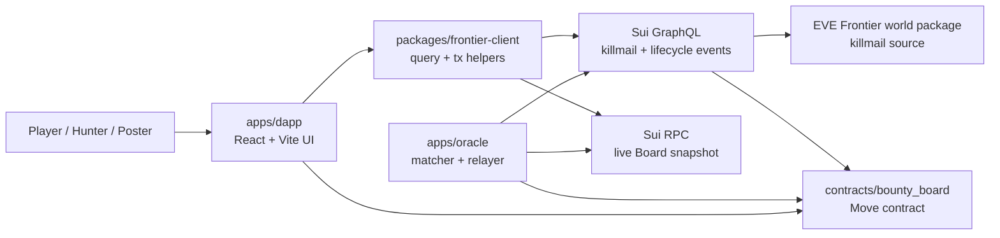

# Blood Contract

Blood Contract is a player-driven bounty system for EVE Frontier. A player locks rewards into an on-chain contract, points that contract at a target, chooses whether the objective is ship kills or structure kills, sets how many kills are required, and defines how long the contract stays live. When a hunter satisfies the conditions, the reward can be claimed directly from the contract.

The practical goal is simple: make bounty hunting feel like an actual PvP system instead of a one-off side activity. The contract holds the reward, killmail data provides the proof signal, and the oracle writes verified outcomes back on-chain. That gives the loop clear incentives, real persistence, and a reason for conflict to keep escalating instead of disappearing after one fight.

## What Blood Contract Supports

- Standard Bounties: one target, one kill, one payout.
- Ship / Structure Filters: restrict a contract to ship kills, structure kills, or any loss.
- Multiple Kills Contracts: split one reward pool across repeated eliminations of the same target.
- Future Killer Bounties: if a protected player dies, the killer automatically becomes the next bounty target.
- Auto Sort: the dapp surfaces active contracts by highest total reward, per-kill reward, or time remaining.

## How It Works

1. A player creates a bounty or future-killer insurance order in `contracts/bounty_board`.
2. The dapp reads contract state through `packages/frontier-client`.
3. The oracle watches two external feeds:
   - Blood Contract lifecycle events from the local package
   - killmail events from the EVE Frontier world package
4. When a killmail matches an active contract, the oracle submits the settlement transaction with `OracleCap`.
5. Hunters claim their rewards directly from the on-chain object.

## Architecture



### Read Path

- Killmail feeds and contract lifecycle feeds are GraphQL-first.
- The live `Board` registry snapshot is read through RPC because the frontend and oracle need current object truth, not just historical events.
- React code does not embed raw GraphQL strings; all query documents and mapping logic live in `packages/frontier-client`.

### Write Path

- Players create, fund, claim, and refund contracts through Move calls built in `packages/frontier-client/src/transactions`.
- The oracle is the only actor allowed to write verified killmail outcomes back on-chain through `OracleCap`.
- Terminal objects are deleted on-chain and close events are emitted so the oracle can remove them from its active index.

## On-Chain Model

- `Board`: shared registry/config root for active contract ids and protocol limits.
- `SingleBountyPool<T>`: one target, one verified kill, one reward pool.
- `MultiBountyPool<T>`: one target, repeated verified kills, reward split across kills.
- `InsuranceOrder<T>`: future-killer order that spawns a new bounty against the killer after the insured player dies.
- `OracleCap`: scoped authority for verified settlement writes only.

## Repository Layout

- `apps/dapp`: React dapp for browsing, sorting, creating, claiming, and refunding contracts.
- `apps/oracle`: Bun daemon that indexes lifecycle events, watches killmail events, and writes settlements back on-chain.
- `packages/frontier-client`: GraphQL queries, RPC reads, environment constants, token config, and transaction builders.
- `contracts/bounty_board`: Move package and unit tests.
- `scripts`: deployment utilities such as package-id syncing and publish helpers.
- `docs`: architecture, oracle notes, killmail notes, and frontend visual direction.
- `skills/eve-frontier-utopia`: repository-local skill for agent-assisted work in the Utopia environment.

## Current Product Shape In This Repo

What exists today is already more than a mock frontend:

- the Move package supports single bounties, multi-kill bounties, and future-killer insurance orders
- the oracle maintains an SQLite active index and replays lifecycle streams safely
- the dapp can create contracts, inspect active board state, and claim or refund funds
- killmail data is treated as the external verification feed from the world package

The important caveat is that settlement is still oracle-driven. Rewards are not auto-released directly from raw frontend reads; the oracle matches killmail events and submits the authoritative settlement transaction.

## Network And Data Rules

- Utopia only.
- Sui testnet only.
- Killmail events come from the EVE Frontier world package.
- Package ids and endpoints live in `packages/frontier-client/src/constants`.
- GraphQL is the default read surface for feeds; RPC is used for current board object truth.
- `packages/frontier-client` is the boundary for chain reads and transaction builders.

## Getting Started

1. Install dependencies.
2. Copy the sample environment file.
3. Start the dapp.

```bash
bun install
cp .env.example .env.local
bun run dev
```

The default frontend entrypoint is `apps/dapp`.

## Common Commands

```bash
bun run dev
bun run build
bun run oracle:dev
bun run oracle:start
bun run typecheck
bun run lint
bun run test
bun run test:move
bun run sync:addresses
bun run publish:bounty-board
```

## Environment

`.env.example` already includes a working reference layout. The variables are split into two groups:

### Frontend Runtime

- `VITE_SUI_NETWORK`
- `VITE_SUI_GRAPHQL_URL`
- `VITE_SUI_RPC_URL`
- `VITE_WORLD_API_URL`
- `VITE_WORLD_PACKAGE`
- `VITE_WORLD_OBJECT_REGISTRY_ID`
- `VITE_BOUNTY_BOARD_PACKAGE`
- `VITE_BOARD_ID`
- `VITE_SIMULATION_WORLD_PACKAGE`
- `VITE_SIMULATION_WORLD_ADMIN_ACL_ID`
- `VITE_SIMULATION_WORLD_KILLMAIL_REGISTRY_ID`
- `VITE_CLOCK_OBJECT_ID`
- `VITE_CUSTOM_COIN_TYPE_HINT`
- optional `VITE_SUPPORTED_TOKENS_JSON`

### Oracle Runtime

- `UTOPIA_GRAPHQL_URL`
- `SUI_GRPC_URL`
- `WORLD_PACKAGE_ID`
- `WORLD_OBJECT_REGISTRY_ID`
- `BOUNTY_BOARD_PACKAGE_ID`
- `BOARD_ID`
- `ORACLE_CAP_ID`
- `ORACLE_PRIVATE_KEY`
- `ORACLE_DB_PATH`
- `ORACLE_POLL_INTERVAL_MS`
- `ORACLE_GRAPHQL_PAGE_SIZE`
- `ORACLE_HEALTH_PORT`
- `CLOCK_OBJECT_ID`

Notes:

- `scripts/sync-addresses.ts` updates generated deployment ids after publish.
- Oracle config falls back to generated deployment ids when explicit oracle ids are not provided.
- The simulation-world values are used by the local killmail tooling in the dapp.

## Development Workflow

1. Change Move code in `contracts/bounty_board`.
2. Run `bun run test:move`.
3. Publish the package when ready.
4. Run `bun run sync:addresses`.
5. Restart the oracle if package ids changed.
6. Verify dapp reads, matching rules, and claim flows end to end.

## Operational Notes

- The oracle exposes `/healthz` and `/readyz`.
- Oracle state is stored in SQLite at `.data/oracle.db` by default.
- The board registry is intentionally explicit. This repo avoids on-chain lookup trees and expects oracle infrastructure to index active object ids from emitted events.
- Auto Sort is currently a UI capability over the active board snapshot, not a separate ranking service.

## Known Assumptions

- The repo is built around the current Utopia/testnet world package and its killmail schema.
- `world::killmail::KillmailCreatedEvent` is treated as the external truth signal for matching.
- If an upstream package id, registry id, or event schema changes, both env config and `packages/frontier-client` mappings need to be updated.

## Further Reading

- `docs/architecture.md`
- `docs/oracle.md`
- `docs/world-contracts-killmail.md`
- `docs/frontend-style.md`
- `AGENTS.md`
