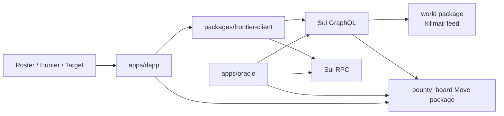

# Architecture

## System View

## Read Path

The dapp reads chain data through `packages/frontier-client`.

- GraphQL request code lives in `src/graphql`.
- Event feeds come from GraphQL:
  - world killmail events
  - `bounty_board` lifecycle events
- Live board state comes from RPC object reads:
  - `Board`
  - active `SingleBountyPool<T>`
  - active `MultiBountyPool<T>`
  - active `InsuranceOrder<T>`

This split is intentional. Event streams are the right source for replay and matching, while RPC object reads are the right source for current shared-object truth.

## Write Path

The write surface lives in `contracts/bounty_board`.

- `init(ctx)` publishes the shared `Board` object.
- `OracleCap` is transferred to the deployer and is only for verified killmail write-back.
- Players create, fund, claim, and refund contracts directly against shared objects.
- The oracle writes settlement outcomes back with concrete shared object ids.

## Active On-Chain Objects

- `Board`
- `SingleBountyPool<T>`
- `MultiBountyPool<T>`
- `InsuranceOrder<T>`
- `OracleCap`

Important constraints:

- No on-chain lookup tree is used for search.
- `Board` is a registry/config root, not a generic admin wallet.
- Oracle infrastructure is expected to index active objects from emitted events.
- Terminal objects are deleted on-chain and emit close events so off-chain indexes can remove them cleanly.

## Matching Model

- `bounty_board` emits creation, funding, settlement, trigger, and close events.
- The oracle stores active records and cursors in SQLite.
- The oracle listens to `world::killmail::KillmailCreatedEvent`.
- When a killmail matches bounty rules, the oracle submits the settlement call with the concrete shared object.

## Supported Rule Dimensions

- target character via `Character` / `TenantItemId`
- loss filter: `AnyLoss`, `ShipOnly`, `StructureOnly`
- mode: single kill or configurable multi-kill
- optional note capped at 64 bytes
- future-killer insurance that spawns a new bounty against the killer

## Network Rules

- EVE Frontier Utopia only
- Sui testnet only
- keep endpoints and published ids in `src/constants`
- update generated deployment values through `scripts/sync-addresses.ts`
